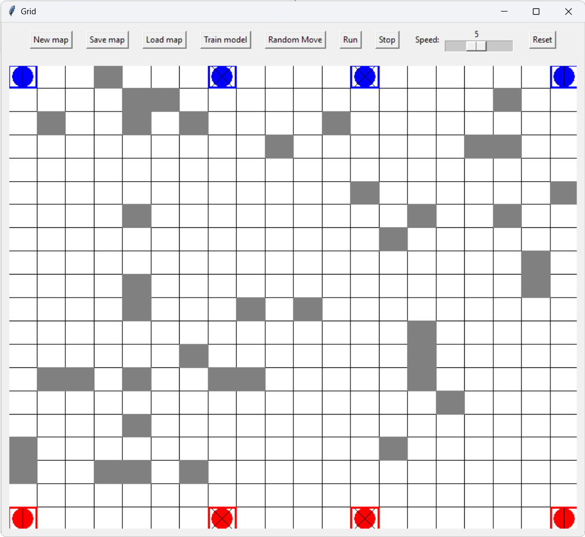

# INFO-H512 ABM robots simulations

## Third-party libraries

- tensoflow
    The library offers a framework to easily create machine learning models. <br/>
    You can install it with pip:
    ```bash
    pip install tensorflow
    ```

- tqdm
    The library offers a convenient way to visualize the progression of a loop in the terminal. <br/>
    You can install it with pip:
    ```bash
    pip install tqdm
    ```

- numpy
    The library offers functions that allows to easily manipulates data arrays. <br/>
    You can install it with pip:
    ```bash
    pip install numpy
    ```

## How to run

In the src directory, you can run the code with the command:
```bash
python main.py
```

The interface should be friendly enought to allow anyone to navigate in the application, but we will still make a summary of the command here:
- *New map:* Load a new random map
- *Save map:* Save the current map (the user can freely choose the directory and the name of the map)
- *Load map:* Load a previously saved map
- *Train model:* Train the ML model. The training process can be see on the map, and a progress bar show the training progression.
- *Random Move:* All the agents on the map will perform a random action.
- *Run:* Run a simulation. The user can choose between a random simulation (random movement only) or a trained simulation, in other words, a simulation using the trained model. *Note: If the model has never been trained, an error will occur*
- *Stop:* Stop the simulation.
- *Speed:* Modify the speed of the simulation.
- *Reset:* Reset the simulation: all agents return to their starting point.

